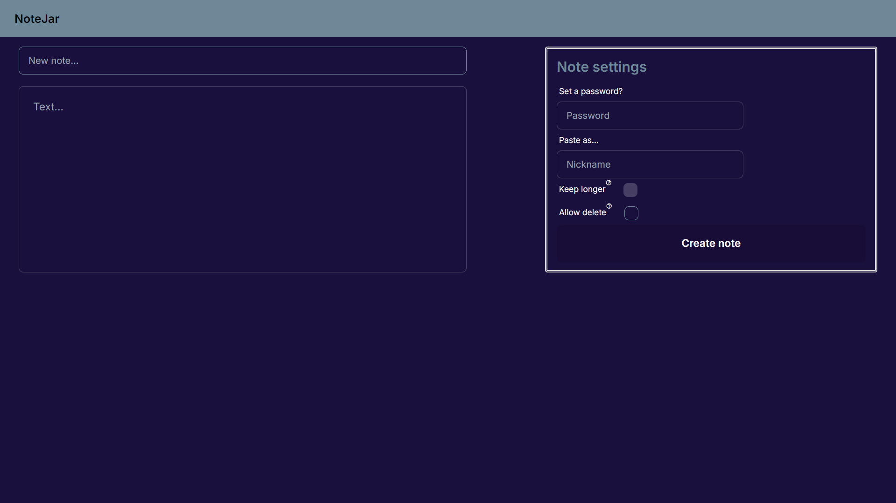
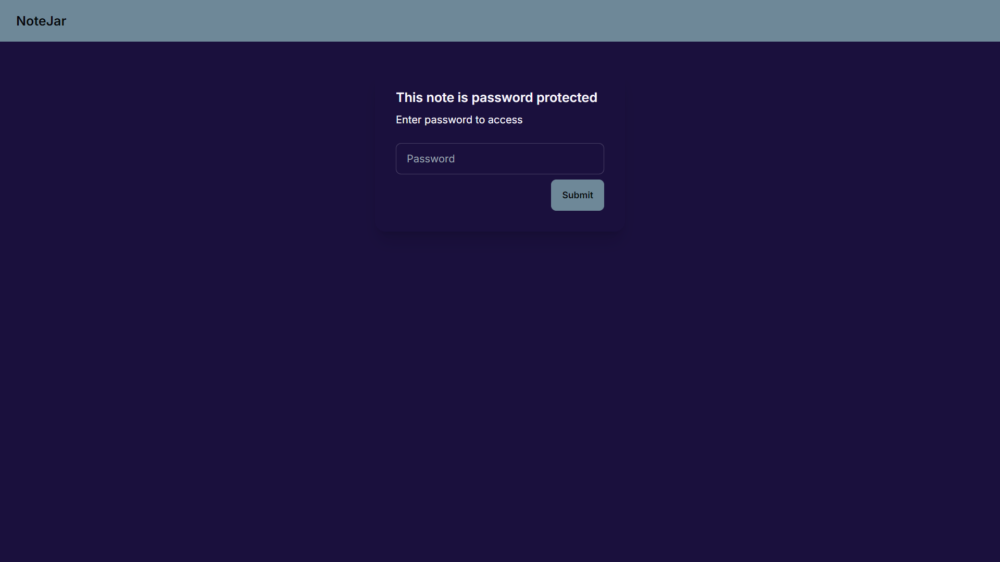
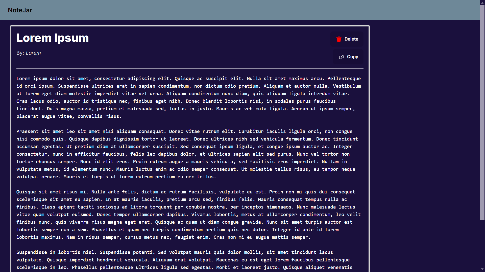

# NoteJar

This is a Pastebin clone with just the essential features to make use of the app. It allows you to set a password as well as allow strangers to delete your note! The "Keep longer" feature doesn't work because I couldn't set up a TTL mechanism in Firestore without upgrading.

I have tried my best to make use of the features of Next.js, although there are most definitely plenty of newbie mistakes.

Below are some screenshots of this app.

# Homepage

# Password Verification

# Note

